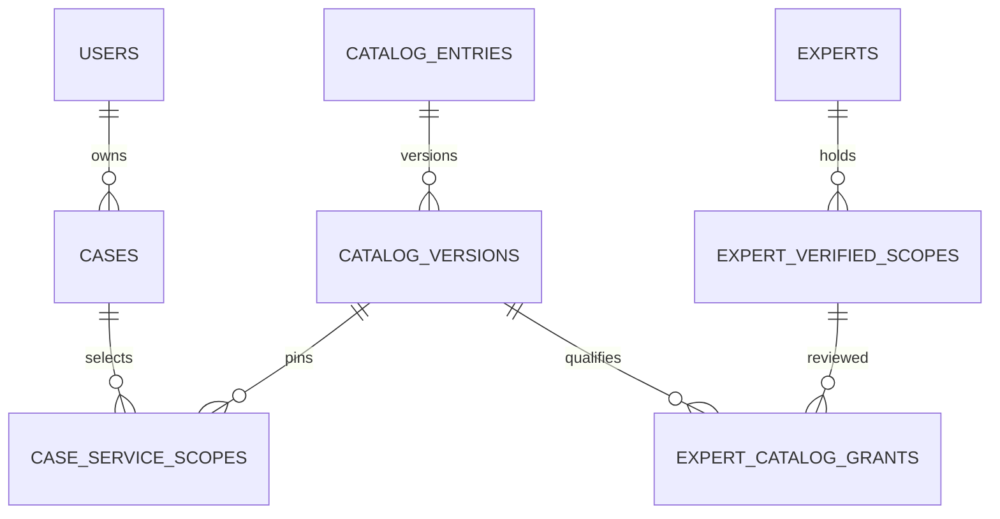

# Database mapping and architecture
Thin controllers delegate validation to FormRequests, serialization to Resources and authorization to Gates/
existing Policies. Multi-step catalog/case mutations use transactions and the catalog mutex. Existing audit,
privacy idempotency, encrypted intake, private documents, KYC and renewal are reused.

Existing users, expert profiles, user contexts, case_intake_versions, case_context_snapshots,
case_documents/versions, audit_events, policy_versions/consent_records and idempotency_records are reused.
No parallel Profile/Context/Auth table is introduced.

| API field / concept | Storage | Notes |
|---|---|---|
|User residence|Existing User/Profile fields|Never derives scope jurisdiction or expert country|
|caseCountry|cases.jurisdiction + current intake payload jurisdiction|Compatibility mapping; problem metadata only|
|status (v2)|cases.readiness_status|Legacy cases.status retains four-state storage projection|
|version|cases.version|Optimistic mutation version|
|intake.*|case_intake_versions.payload (encrypted)|Immutable input history; current_intake_version_id pointer|
|contract version|cases.catalog_contract_version|1 for legacy records until explicit v2 editing/selection|
|confirmation|cases.readiness_confirmation|Server HMAC, never client assignable|
|readinessCheckedAt|cases.readiness_checked_at|UTC checked timestamp|
|taxonomy kind/code/parentId/labels|catalog_nodes kind/code/parent_id/labels|Country->jurisdiction; domain->specialty->service|
|domain regulated classification|catalog_nodes.regulated|Null fails closed; regulated service may strengthen a general domain|
|safety keyword policy|catalog_nodes.rules|Admin-created immutable rules; status/audit controlled|
|catalogEntryId|catalog_entries.id|Stable service-policy identity, code unique|
|catalogVersion|catalog_versions.version|Unique within entry, distinct from row ID and revision|
|policy/revision/status|catalog_versions.policy/revision/status|Immutable policy JSON + hash; reviewed_by/published_by/created_by|
|policy domain/specialty/serviceType|catalog_versions.domain_code/specialty_code/service_code|Indexed materialized codes, set from immutable policy|
|service jurisdiction country|jurisdiction node parent country|GLOBAL has no country; MULTI_COUNTRY uses each exact configured jurisdiction|
|scopes[].answers|case_service_scopes.answers (encrypted)|Answers validated against selected version schema|
|deliveryMode/jurisdictionCodes|case_service_scopes.delivery_mode/jurisdiction_codes|No inference from residence|
|scope policySnapshot|case_service_scopes.policy_snapshot (encrypted)|Policy/id/version/hash, jurisdiction set, intake version, context snapshot IDs, document versions, consent references|
|scope lifecycle|status/reason_codes/submitted_at/detached_at/readiness_checked_at|Detach retains history; submitted policy/input immutable|
|explicit expert eligibility|expert_catalog_grants|FK scope_id + catalog_version_id + jurisdiction_code, evidence IDs, reviewer, revoked_at|
|serialization revision|catalog_locks id1/revision|Singleton lock and confirmation/impact invalidation|

Unique indexes: node(kind,code), entry(code), catalog version(entry_id,version),
grant(scope_id,catalog_version_id,jurisdiction_code). Query indexes cover nodes kind/status/parent,
versions status/domain/id and specialty/service, scopes case/status and version/status,
grants version/jurisdiction/revoked and case owner/readiness/updated.
FKs prevent dangling scope/version/grant identities; referenced policies are not deletable through the API.

Case reads do not create transactions. Mutations lock catalog mutex, User, Case, then ordered Expert parents
where coverage is rechecked. KYC/renewal already lock expert parents. The coarse catalog mutex favors correctness
for the first release; measure contention before higher traffic. Readiness bounds scopes20, schema50 and documents20;
coverage is a database eligibility check, not a rank or a capacity reservation.

No backfill invents exact scope mappings. Existing ready records without snapshots are explicitly flagged for
review by the command. Existing legacy primary_domain/case_domains are historical v1 projections; canonical v2
domains are in selected service scopes. Do not build v2 matching from the legacy columns.
