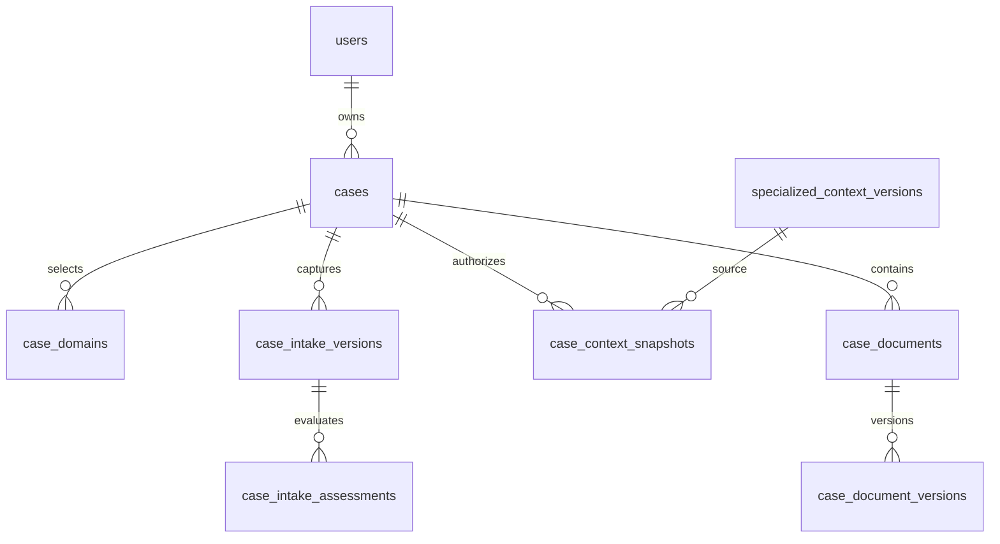

# Database mapping and ERD
Seven new tables. Existing users, contexts/versions, policy/consent records, audit_events and idempotency_records reused.
PHP CaseRecord maps to table cases. All sensitive writes use explicit forceFill of server-assembled allowlists.

| API | Table.column | Semantics |
|---|---|---|
|id|cases.id|server-generated owner-scoped identifier|
|owner|cases.user_id|Sanctum User only, never input|
|status|cases.status|CaseStatus transition mechanism only|
|version / expectedVersion|cases.version|optimistic write version, distinct from intake version|
|primaryDomain|cases.primary_domain|catalog key, selected domains checked at submit|
|domains|case_domains.domain|unique(case_id,domain), reverse(domain,case_id) index|
|jurisdiction|cases.jurisdiction|ISO country validation; enabling is separate product config|
|language / urgency|cases.language / urgency|allowed input enums|
|suitability|cases.suitability|current outcome, not_assessed after material changes|
|confirmedAssessmentId|cases.confirmed_assessment_id|server-selected own latest immutable assessment|
|confirmedAt/submittedAt/cancelledAt|cases timestamps|server UTC|
|title/problemDescription/desiredOutcome/answers/serviceNeeds/lastCompletedStep/privacyChoice/subjectType|case_intake_versions.payload|encrypted immutable per-input snapshot|
|schemaVersion/intakeVersion|case_intake_versions.schema_version/version|schema and input sequence; unique(case_id,version)|
|current intake|cases.current_intake_version_id|service-maintained pointer to own intake row|
|relatedCases|cases.title_fingerprint|keyed HMAC normalized title, own-only exact matches capped5|
|contextSnapshots[].sourceContextVersionId|case_context_snapshots.source_context_version_id|FK immutable source version|
|contextSnapshots[].snapshot|case_context_snapshots.payload|encrypted selected facts + contextId/version/domain/country|
|selectedFactKeys/authorizedAt/policyVersionId|case_context_snapshots fields|per-case explicit authorization, exact fields and Privacy policy reference|
|detachedAt|case_context_snapshots.detached_at|logical detachment; snapshot fields immutable|
|assessment|case_intake_assessments.result|encrypted immutable rule result, suggestions and clarification codes|
|assessment provenance|intake_version_id,input_fingerprint,rules_version|bind to input and relevant config/policy/document state|
|documents[].id|case_documents.id|logical document, belongs to one case|
|documents[].currentVersion|case_documents.current_version_id|service-maintained latest revision pointer|
|documents[].deletedAt|case_documents.deleted_at|logical removal, denies all binary/history routes|
|document version/title/category|case_document_versions fields|immutable sequence and encrypted title; unique(document_id,version)|
|mimeType/size/checksum|mime_type/size/checksum|server content inspection, bytes and SHA256|
|scanStatus/scanReason/scannedAt|scan_status/scan_reason/scanned_at|worker-owned, unavailable never means clean|
|NOT EXPOSED|disk,path|private encrypted storage reference|
|timeline|audit_events|subject_type=case; no actor IDs/token IDs/internal metadata in User projection|
|Idempotency-Key|idempotency_records|existing hashed keys, encrypted responses,24h scope actor+route+IDs|

FKs use restrictOnDelete, not cascading erasure. Current-version pointers are maintained only in locked services,
following existing R3 pointer convention; cross-table owner consistency is validated at service boundaries.
Indexes: cases(owner,updated,id), (owner,status,updated,id), (status,submitted,id), (owner,title_fingerprint);
case_domains(domain,case_id); snapshots(case_id,detached_at,id); assessments(case_id,intake_version_id,id);
documents(case_id,deleted_at,id); document_versions(scan_status,created_at). Each child has indexed FK.
No free-text SQL LIKE search over encrypted narrative. Lists eager load domains/input; Admin never decrypts input.

